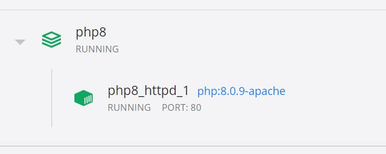

# WDD Course - PHP/Apache2 Container

This is a PHP/Apache stack for use with PACE WDD courses.  It should be used inconjunction with WDD Mariadb or WDD Mysql to provide a full LAMP stack development environment.

The PHP/Apache stack has been pre-configured with:

* vim
* nano
* composer
* basic PHP extensions (pdo_mysql, gd, dom, zip, etc.)

If you need additional extensions, you can carefully add them to the `Dockerfile` and rebuild the image.

Download Docker Desktop here: [https://www.docker.com/products/docker-desktop](https://www.docker.com/products/docker-desktop)

## Instructions

**Before you begin:** _Make sure you shut down XAMPP, MAMP, or WAMP.  Halt any Vagrant machines you are using.  If you are running Apache or MySQL as Windows Services, turn them off.  If any of these are running, they will interfere with the port requirements for the php/apache and mariadb containers, and the containers will not start.  Alternatively, edit the `.env` file and change the `LOCAL_HTTP_PORT` or `LOCAL_MYSQL_PORT` values in the container's respective `.env` files._

* Download a zip archive of this repository.  I recommend putting it somewhere that is not backed up by OneDrive or Dropbox... there will be a lot of changing files if you use composer or node, and syncing with a backup service could slow your system.

* Rename the unpacked folder to whatever course you are taking.  e.g. `intro_php`.  You will download and use a new version of this container for every course that requires it.

* The default settings in `docker-compose.yml` should work just fine, but you can edit if you need to.

* You have an `html` folder inside this folder.  This is the default `DocumentRoot` for your Apache/PHP installation.   The current folder `.` is mapped to `/var/www` in the container.  If you want to modify the location of the default vhost, or add new vhosts, you can open the container CLI and add vhost configuration files in `/etc/apache2/sites-available` 

* When you are ready, run the following command, inside this folder. 

```bash
	# --build required on first run only
	docker-compose up -d --build
```

* After the image downloads and the container builds and runs (could take 2 minutes for first run), visit `http://localhost` to see if it worked.  You can also check the Docker dashboard.  You should see something like this:



* To use mysql or mariadb, you also need to download their respective containers and follow the instructions in their README files.

* After the first run, you can manage the PHP/Apache container through the Docker Desktop dashboard, or from a bash shell using the following commands:

```bash

	# To gracefully shut down your container
	docker-compose down

	# To start your container
	docker-compose up -d

	# Note: the -d flag detaches the container process so you
	# don't have to keep the terminal open while it's running.

```

  
  